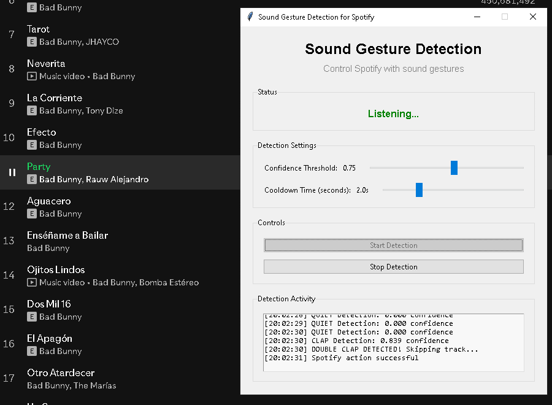

# Sound Gesture Control for Spotify - Machine Learning

Control Spotify to skip or pause songs with sound gestures (like double claps) using machine learning, audio analysis, ensemble models, real-time audio detection, and the Spotify Web API.

---

## Table of Contents
- [Description](#description)
- [Features](#features)
- [Requirements](#requirements)
- [Setup](#setup)
- [How It Works](#how-it-works)
- [Script Usage & Order](#script-usage--order)
- [Customizing Gestures](#customizing-gestures)

---

## Screenshots

<details>
<summary>Click here to expand screenshots</summary>


| Listening State | Double Clap Detected (Song Skipped) |
|:--------------:|:-----------------------------------:|
|  |  |


</details>

## Description
This project uses your microphone and machine learning to recognize sound gestures (like double claps) to pause or skip songs on Spotify. It extracts many audio features and uses an ensemble of 4 machine learning models for accurate gesture detection.

## Features
- **Audio Analysis**: extracts temporal, spectral, and onset detection features
- **Ensemble Machine Learning**: 4-model ensemble (Random Forest, SVM, Gradient Boosting, Neural Network) 
- **Real-time Detection**: live audio processing with configurable confidence thresholds
- **Advanced Training**: SMOTE balancing, class weights, and grid search optimization
- **Spotify Web API**: skip, pause songs etc.
- **Clean Audio Processing**: DC offset removal, filtering, and normalization

> **Note:**
> The ensemble ML models are trained to distinguish double claps from common background noises like music, talking, typing, and other sounds.

## Requirements
- Spotify Premium account
- [Spotify Developer App](https://developer.spotify.com/dashboard/applications) (for API credentials)
- Microphone

**Python packages:**
- librosa, numpy, sounddevice, joblib, spotipy, python-dotenv, scikit-learn, scipy, imbalanced-learn

Install all dependencies with:
```
pip install -r requirements.txt
```

## Setup
1. **Clone the repository:**
   ```
   git clone https://github.com/yourusername/ML-Sound-Gestures.git
   cd ML-Sound-Gestures
   ```
2. **Create a Spotify Developer App:**
   - Go to the [Spotify Developer Dashboard](https://developer.spotify.com/dashboard/applications)
   - Create a new app and set the redirect URI to `http://127.0.0.1:8888/callback`
   - Copy your Client ID and Client Secret
3. **Configure environment variables:**
   - Copy `.env.example` to `.env` and fill in your credentials:
     ```
     SPOTIPY_CLIENT_ID=your_client_id_here
     SPOTIPY_CLIENT_SECRET=your_client_secret_here
     SPOTIPY_REDIRECT_URI=http://127.0.0.1:8888/callback
     ```

4. **Prepare your audio data:**
   - Place your double clap samples in `data/raw/double_clap/`
   - Place negative samples (background noise, music, speech) in `data/raw/negative/`
   - Ensure diverse training data for robust model performance
   - (Optional) Add more gesture folders for future expansion

> **Note:**
> The `data/raw` and `data/processed` folders are included empty (with `.gitkeep` files) on purpose. Populate with your own audio data to train the model.


## How It Works

### 1. Audio Preprocessing
- Cleans up the audio signal by removing noise and normalizing levels
- Uses RobustScaler normalization to standardize features for consistent ML input
- Prepares audio for accurate feature extraction

### 2. Feature Extraction
- Analyzes audio characteristics like timing, frequency, and sound patterns
- Extracts features that distinguish double claps from other sounds
- Uses temporal, spectral, and onset detection methods

### 3. Machine Learning Training
- Trains 4 different ML models: Random Forest, SVM, Gradient Boosting, and Neural Network
- Uses SMOTE balancing and grid search to optimize performance
- Combines all models into an ensemble with confidence-weighted voting for better accuracy

### 4. Real-Time Detection
- Listens to your microphone continuously
- Checks for double claps every 0.5 seconds using 1.5 second audio samples
- Uses confidence thresholds and cooldown periods to prevent false triggers
- Controls Spotify when a double clap is detected


## Script Usage & Order

**1. Extract features from your audio data:**
[`src/extract_features.py`](src/extract_features.py)
```
python src/extract_features.py
```
- Processes audio files from `data/raw/` and extracts comprehensive audio features
- Saves processed features as `X.npy` and labels as `y.npy` in `data/processed/`
- Includes temporal, spectral, and onset detection features

**2. Train the ensemble machine learning model:**
[`src/train_model.py`](src/train_model.py)
```
python src/train_model.py
```
- Trains 4-model ensemble with SMOTE balancing and grid search optimization
- Saves the ensemble model as `model.joblib` and scaler as `scaler.joblib` in `data/processed/`

**3. Test Spotify connection (optional):**
[`src/connect_spotify.py`](src/connect_spotify.py)
```
python src/connect_spotify.py
```
- Verifies your Spotify API setup by skipping a track

**4. Run the real-time detection application:**
[`src/listen.py`](src/listen.py)
```
python src/listen.py
```
- Real-time double clap detection with configurable confidence thresholds
- Automatically skips Spotify tracks when successfully detecting gestures


## Customizing Gestures
- **Adding New Gestures**: Create new folders in `data/raw/` with your gesture samples, then re-run the feature extraction and training pipeline
- **Spotify Actions**: Edit the `sound_gesture` function in [`src/connect_spotify.py`](src/connect_spotify.py) to map gestures to different Spotify actions (pause, previous track, volume control, etc.)
